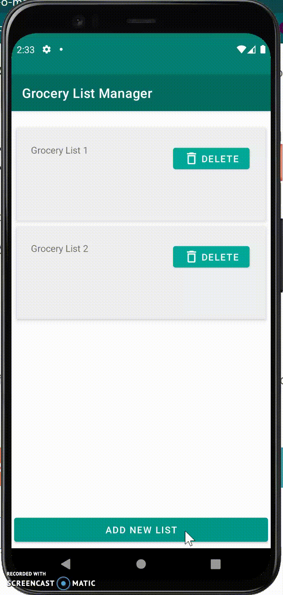

# GroceryListManager
Grocery List Manager for Android

This app is made with Kotlin and SQLite, and allows users to manage multiple grocery lists. Base functionality includes the ability to create and delete lists, and manage items
within each list; with base actions such as adding, deleting, editing, and filtering list items. Each item has a detail page that allows the user to see an item's quantity and 
category upon selection. Each individual list is stored in a database, so data persists with use.
     

How to select a list.

    
 

How to delete a list.

   

How to add a list.

   

How to insert a list item.

   

How to edit a list item.

   

How to delete a list item.

   

How to move an item to a different list.

   

How to query/filter list items by category.

   

